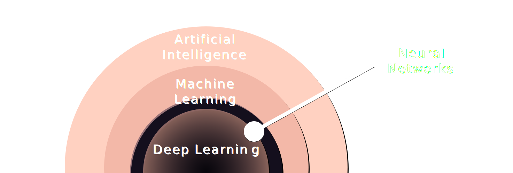
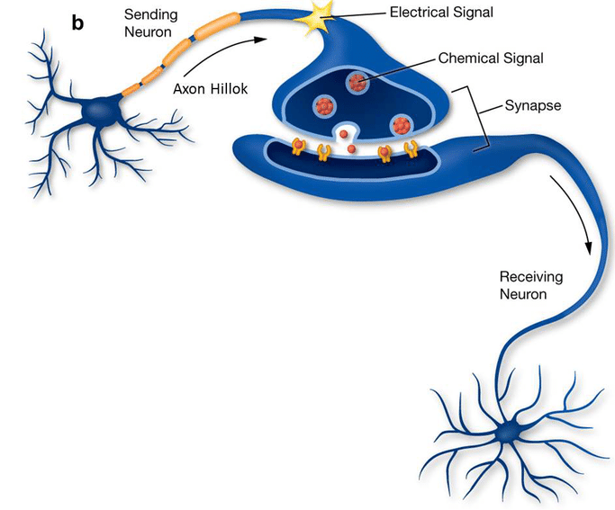
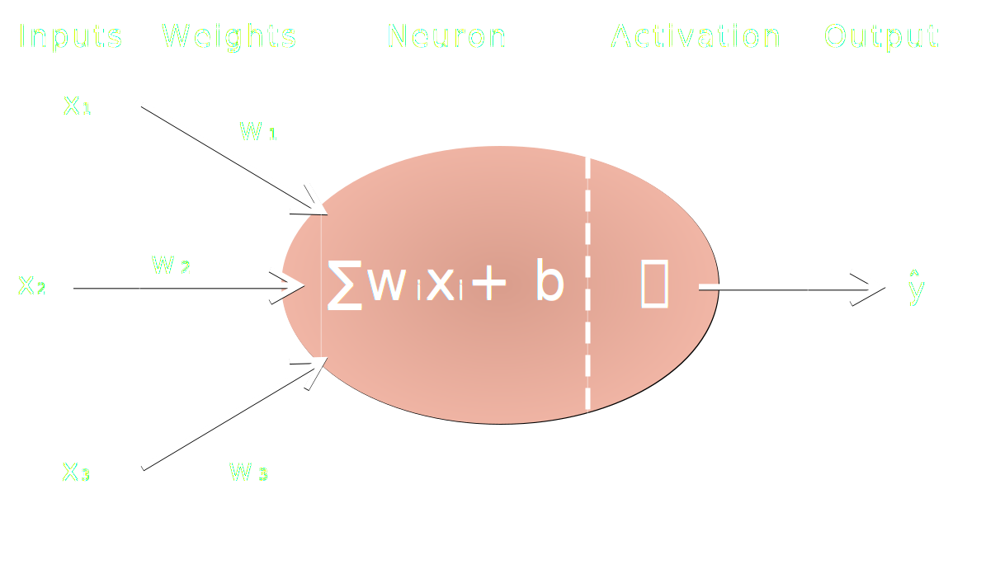
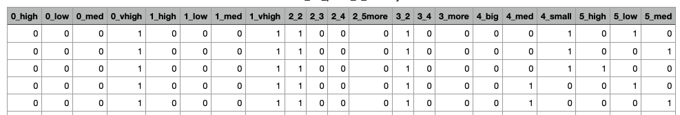
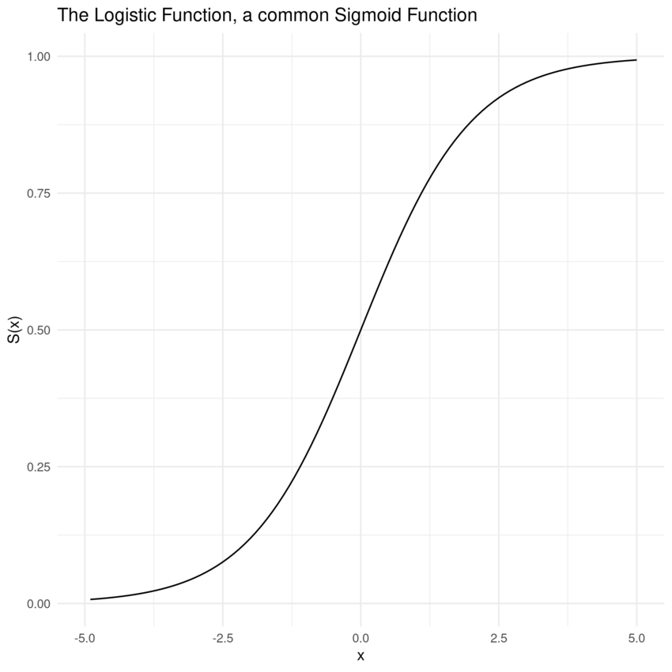
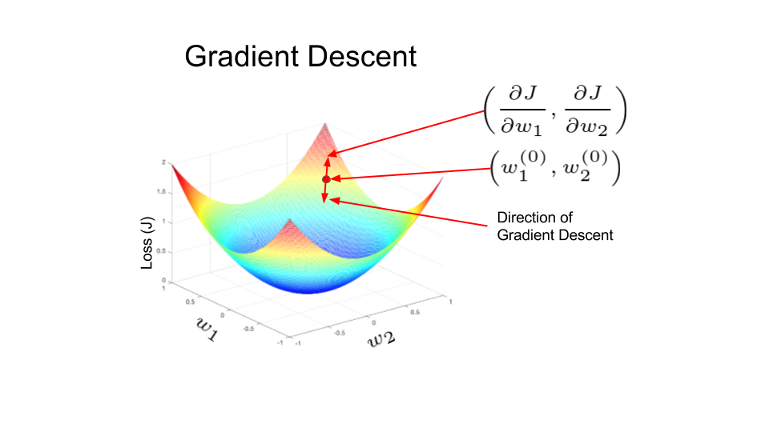
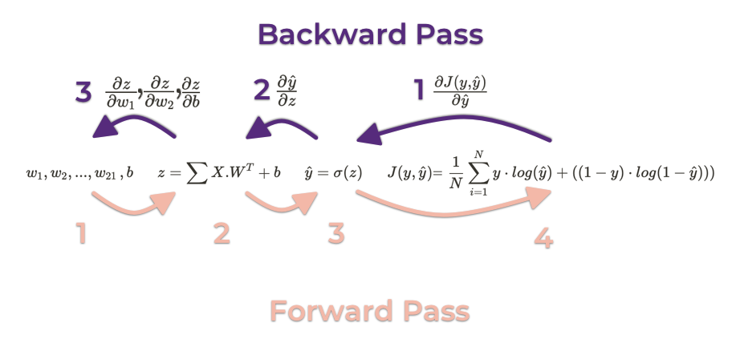

<p class="is-size-6 has-text-centered">Image Credit: Ramón Salinero at Unsplash</p>

<br/>
<br/>
  
This is a series of blog posts that will go through the process of building a deep neural network from scratch. I will use some math fundamentals and then code that into building blocks to create a NN framework like PyTorch and Keras.

<br/>

## What is a Neural Network?


A neural network is one type of machine learning algorithms that is inspired by biology, particularly, neural networks in our own brains!

<br/>
<br/>

<p class="is-size-5 has-text-centered">Figure 1. Artificial Intelligence Landscape</p>
<br/>
<br/>
<br/>

Our brains consist of billions of neurons connected together via axons. Neurons transfer information in the form of electric signals. A neuron receives an electric signal as input through the movement of some chemicals from the synapse of the axon of the sending neuron to the synapse on the dendrites of the receiving neuron. A nneuron only fires if the signal it receives exceeds a certain threshold.

<br/>
<br/>
<div class="is-flex-direction-row">
    
</div>
<p class="is-size-5 mt-4 has-text-centered">Figure 2. Neurons in Human Brain</p>
<p class="is-size-6 mt-0 has-text-centered">Image Credit: Castagnola, Valentina. (2014). Implantable microelectrodes on soft substrate with nanostructured active surface for stimulation and recording of brain activities.</p>
<br/>
<br/>
<br/>

In a somewhat similar manner, artificial neural networks (ANNs) are composed of of neurons (nodes/units) that receive inputs, each input has a certain "weight" for its connection (edge) with the neuron determining its importance with regards to the ouput. Inside the neuron a calculation is made on the weighted inputs, basically summing them and adding a "bias" (intercept) input as shown in Fig. 3.  The result of that calculation is passed through an activation function to determine whether the neuron should "fire" or not and that gives us our output as in Eq. 1. The output of a neuron is received by a consecutive neuron in most cases.
  
<br/>
<br/>

### Structure of a Neuron
<br/>
Let's start by drawing and coding one neuron, which is synonymous with a logistic regression function. This is the atmoic building block of any ANN.

<br/>
<br/>

<p class="is-size-5 has-text-centered">Figure 3. An artificial neuron</p>
<br/>
<br/>
<br/>

$$
\hat{y} = \sigma({\sum{w_{i}x_{i}} + b)} \tag{Eq. 1}
$$

<br/>
<br/>
This is too abstract to understand and code. It's better to implement this with an example. For this, I downloaded a small dataset for car evaluation from <a href="https://archive-beta.ics.uci.edu/ml/datasets/car+evaluation">UC Irvine Machine Learning Repository</a>. The dataset contains 6 features (attributes) and 1 field for labels. For simplicity, I edited this datasets so it has 2 possible classes as output (instead of 5 originally). Below are the first rows of the dataset.

<br/>

<table class="table mt-5 is-striped is-size-4">
    <thead>
        <tr>
            <td>Buying Price (x1)</td>
            <td>Maintenance Cost (x2)</td>
            <td>Doors (x3)</td>
            <td>Persons (x4)</td>
            <td>Lug Boot (x5)</td>
            <td>Safety (x6)</td>
            <td>Class (y)</td>
        </tr>
    </thead>
    <tbody>
        <tr>
            <td>vhigh</td>
            <td>med</td>
            <td>3</td>
            <td>4</td>
            <td>big</td>
            <td>low</td>
            <td>unacc</td>
        </tr>
        <tr>
            <td>vhigh</td>
            <td>med</td>
            <td>3</td>
            <td>4</td>
            <td>big</td>
            <td>med</td>
            <td>acc</td>
        </tr>
        <tr>
            <td>vhigh</td>
            <td>med</td>
            <td>3</td>
            <td>4</td>
            <td>big</td>
            <td>high</td>
            <td>acc</td>
        </tr>
        <tr>
            <td>vhigh</td>
            <td>med</td>
            <td>3</td>
            <td>more</td>
            <td>small</td>
            <td>low</td>
            <td>unacc</td>
        </tr>
        <tr>
            <td>vhigh</td>
            <td>med</td>
            <td>3</td>
            <td>more</td>
            <td>small</td>
            <td>med</td>
            <td>unacc</td>
        </tr>
        <tr>
            <td>vhigh</td>
            <td>med</td>
            <td>3</td>
            <td>more</td>
            <td>small</td>
            <td>high</td>
            <td>acc</td>
        </tr>
    </tbody>
</table>

<br/>
<br/>
We have 6 input features x1, ..., x6 and 1 class (y). The input features which are the buying price, maintenance cost, number of doors, number of perople, lug boot and safety all determine the outcome, is a car acceptable or not. Class labels are either 0 (car not acceptable) or 1 (car is acceptable). We want to know which of the input features have more influence on a car's acceptability, thus we will need to learn a set of parameters w1, ..., w6 and b as in Eq.2.

<br/>
<br/>

$$
\hat{y} = w_{1}x_{1} + w_{2}x_{2} + w_{3}x_{3} + w_{4}x_{4} + w_{5}x_{5} + w_{6}x_{6} + b \tag{Eq. 2}
$$

<br/>
<br/>

We will need to do some data wrangling to make it suitable for a machine learning model. For instance, we need to find a way to transform all the text values to numbers to represent them, that's because machine learning models can understand only numbers. As this is out of scope for this article, I'm not going to dicuss the details of the transformation in this blog post (may be in a dedicated one) and just show the output after the transform.

<br/>
<br/>

<p class="is-size-5 has-text-centered">Figure 4. Data after transforming categorical features into one-hot encoded, labels column separated</p>
<br/>
<br/>
<br/>

I have also split our labels (targets) column and encoded the values there so that any value that was "unacc" is now represented as 0 and any other values "acc", "good", etc is now represented as 1 in order to have two classes only.
<br/>

After transforming our categorical features to one-hot encoded, we have now more than 6 features, in fact we now have 21 features. Due to that change we now expect to have input features ranging from x1, x2, ..., x21 and corresponding weights w1, w2, ..., w21. The bias stays the same (b).

<br/>
<br/>
The code for this first part is easy, we need to initialise a weights array with random numbers, preferably a small value between -0.5 and 0.5. There are many other methods to initialise weights, but they are out of scope for this blog post. Weight initialization is an important step because initializing the weights with zeros will make the neuron dead and no learning shall take place. We need to initialize the bias as well, but this value can be any value; I will initialize it with zero. We have only one bias value because we have only one neuron so far. We will implement the formula shown in Eq. 2.

<br/>
<br/>

<div class="is-size-6 card has-background-black-ter">


```python{25-26,40}{numberLines: true}
import numpy as np
import pandas as pd

# Read our data file which is in csv format using Pandas
cars_df = pd.read_csv('location/of/csv/file', header=None)

# Check if there are any missing values
cars_df.isnull().any()

# Split class column
y = cars_df[6]

# One hot encoding for categorical columns
x = pd.get_dummies(cars_df.iloc[:, :-1])

# Encode y into 0 and 1
y[y != 'unacc'] = 1
y[y == 'unacc'] = 0

# Reading X and y as numpy arrays
x = np.array(x) # shape = (no. of instances, no. of input features) = (1728,21)
y = np.array(y) # shape = (no. of instances, ) = (1728, )

# Randomly initialise weights and bias
W = np.random.uniform(low=-0.5, high=0.5, size=(x.shape[1],1)) # W dims=(no. input features,1)=(21,1)
b = 0 # scalar Value

# Calculate weighted sum of inputs z = x1w1 + x2w2 + ... + x21w21 + b


# Not optimal dur to for loop
#z = 0
# for i in range(x.shape[1]): # for each input feature
#     z += W[i, :] * x[1, i]
# z += b  # add bias outside the loop


# Better way, no for loop, called vectorizing code using the power of numpy
# highlight-next-line
Z = np.add(np.matmul(x, W), b)
```
</div>

<br/>
<br/>

We need to pass the weighted sum through an activation function. The activation function's purpose is to decide whether the neuron should fire or not. There are many activation function that are commonly used based on the problem we're trying to solve. But for the sake of simplicity in this blog post and as it is not the topic today, we will only mention the sigmoid function which we are going to use. Sigmoid function takes a real number and squishes it between 0 and 1 (Fig. 5). Sigmoid is used as activation function when we have a binary classification problem (among other use cases) where we have 2 classes only on the output, as in this problem. The sigmoid function is able to turn the neuron's pre-activated output into a probability of each data point belonging to class 1 (in binary classification with one node on the output). In other terms, for a data point, if the output of the neuron (after activation with sigmoid) is 0.8, then this data point has a high probability of belonging to class 1. The same logic if the output is 0.1, then the corresponding data point has a low probability of belonging to class 1, hence it has a high probability (1 - 0.1 = 0.9) of belonging to class 0.
<br/>
<br/>
Activation functions are important because they introduce non-linearity to our algorithm, without it, all neuron calculations will be linear and learning of complex functions is not possible no matter how many layers we stack in a neural network. The effect for our example here is minimal since we are working with only one neuron, however, its one of the basis of neural network implementations, so it's best practice that we include it even for this simple example.

<br/>
<br/>

<div class="is-flex-direction-row">
    
</div>
<p class="is-size-5 has-text-centered">Figure 5. Sigmoid Function</p>
<p class="is-size-6 mt-0 has-text-centered">Image Credit: DeepAI.org</p>

<br/>
<br/>
<br/>

Sigmoid function can be calculated as in Eq. 3. following the formula is how we implement it in python and calculate the activation for our weighted sums.

<br/>
<br/>

$$
\sigma =  \frac{1}{1 + e^{-z}} \tag{Eq. 3}
$$

<br/>
<br/>

<div class="is-size-6 card has-background-black-ter">

```python{numberLines: true}
# Calculate the output of the neuron after activation

# Sigmoid avtivation function 
def sigmoid(z):
    a = np.zeros([1, 1])
    a = 1 / ( 1 + np.exp(-z))
    return a

# Neuron's activated output
y_hat = sigmoid(Z)
```

</div>

<br/>
<br/>

Great! We're done with the structure of our neuron. But, how will this neuron _learn_?! It's time now to talk about the learning process. First, let us define what is a learning algorithm. A _learning algorithm_ is an algorithm that is able to learn from data. If the data has been labeled, this is called _supervised learning_, if the data has no labels this is called _unsupervised learning_. For our examples in this series, we will work with labeled data, hence, we will be doing supervised learning.

<br/>
<br/>

### The Learning Process: What does the algorithm actually learn when it sees the data? 

<br/>
Every algorithm has a set of _parameters_. These are basically a set of weights, every weight influences the importance of its corresponding input with regards to the output. A large weight strengthens the connection between a certain input and the output, i.e., this input feature is detrimental to the output. Another parameter is the bias which gives more flexibility for the algorithm.

<br/>

For a learning algorithm to learn, it needs a method to _quantify_ its mistakes, i.e., measure its errors every time its output does not match the true label. For this purpose we use a "Cost function" which measures the discrepancy between the algorithm's output and the true label.
<br/>
<br/>

### Cost Function
<br/>
A cost function is one type of objective functions which we need to optimise to reach a minimum value. It's also known as a loss function, however, the term "loss function" can be better used to describe the loss (error) for one data point, while cost is a more general term that is used to calculate the total loss over a whole dataset and that can include other compoenets such as regularization terms. One important requirement for a cost function to be used for deep learning is for it to be _differentiable_ and we'll see why in the following sections.

<br/>
There are many cost functions that are common in the field of deep learning and they differ based mainly on the problem (classification or regression). As we we have a classification problem in this example, we are going to use a suitable cost function called log loss or cross-entropy loss and since we are working with 2 classes only in our dataset, then we will use Binary Cross-Entropy cost function. This function basically compares the probability output by the neuron with the true label. The output of the cost function will be closer to 0 if the predicted output is close to the true label and keeps increasing as the difference between the prediction and the true label increases until it reaches infinity when the difference is equal to 1 (prediction is the complete opposite of the true label). Below is the binary cross-entropy cost function in Eq. 4 averaged over all the samples in our dataset (N).

<br/>
<br/>

$$
J(y, \hat{y}) = - \frac{1}{N} \sum_{i=1}^{N} y \cdot log(\hat{y}) + ((1-y) \cdot log(1 - \hat{y}))  \tag{Eq. 4}
$$


<br/>
<br/>

<div class="is-size-6 card has-background-black-ter">


```python{numberLines: true}
# Calculate loss
J = -1/ y.shape[0] * (special.xlogy(y, y_hat) + special.xlogy((1 - y), (1 - y_hat)))
print('Cost averaged for all samples: ', J)

```
</div>

<br/>
<br/>

### Gradient Descent
<br/>
Finally, for the last ingredient in our learning process, we need a method for the learning algorithm to tune its parameters so that the next time it sees the data, it can predict an output that is closer to the true one, hence, decrease the loss.

If we draw a diagram representing the relationship between the algorithm's parameters and the loss, we might get a graph like in figure 6. When our algorithm is learning, it is basicaly navigating the parameter space, trying to find the lowest point, the "global minimum", where we can say the algorithm has the best (optimal) set of parameters achieving the lowest possible error. When the algorithm is navigating the parameter space, we need a means to know the direction it's moving towards, is it moving towards the global minimum, which is what we need, or away from it towards a higher error? To get the direction of the algorithm, we need to calculate the _gradient_ of the current step in time. The gradient can be calculated by getting the derivative of the current loss with respect to the set of weights and bias. Using the gradient, we can adjust the value of the weights and bias either negatively or positively to nudge the algorithm towards the best values for weights and bias that achieve the minimum loss. This is called the _Gradient Descent Algorithm_ and is the backbone of training neural networks.

<br/>
<br/>

<p class="is-size-5 has-text-centered">Figure 6. Gradient Descent Algorithm</p>
<p class="is-size-6 mt-0 has-text-centered">Image Credit: Aditya Sharma for LearnOpenCV.com</p>
<br/>
<br/>

Understanding the technicalities of how gradient decsent algorithm works needs delving into some math. The starting point of calculating the gradients will be the cost function. In the cost error as we saw before, we calculate the error of our learning algorithm, i.e., how far off it is in its predictions. We want to send that valuable information back to the beginning of our caculations to adjust and re-calculate our set of weights and bias so that the algorithm can get a closer prediction to the true label this time around. Sending the error signal back is called _Backpropagation_, and it is a very important concept in deep learning. To convert the cost we calculated into an error signal then to information to hint to the algorithm which way to go in the parameter space, i.e., should w1 be increased or decrease and by how much, same goes for w2, w3, ..., until w21. Hence, we need to calculate the gradient for each weight separately as well as for the bias. So, we need to take the derivative of the cost function once with respect to w1, then w.r.t. w2, and so on till we get the gradients for all our weights and bias. However, there are multiple steps in our caclulations and there is no direct way to calculate the derivate of our cost function w.r.t. the weights, thus, we will need to take partial derivatives and apply the _chain rule_. Let's see how this is formulated mathematically.

<br/>
<br/>

<p class="is-size-5 has-text-centered">Figure 7. Maths in Forward and Backward Passes</p>
<br/>
<br/>

Step 1: Calculate the partial derivative for binary cross entropy function w.r.t. the neuron's activated output

$$
\frac{\partial{J(y, \hat{y})}}{\partial{\hat{y}}} = - (\frac{y}{\hat{y}} \frac{1-y}{1-\hat{y}})
                                                = \frac{\hat{y} - y}{\hat{y}(1-\hat{y})}  \tag{Eq. 5}
$$

<br/>
<br/>

Step 2: Calculate the partial derivative for neuron's activated output <span class="is-inline-flex"> $ (\hat{y}) $ </span> w.r.t. the neuron's output <span class="is-inline-flex"> $ (z) $ </span>


<br/>
<br/>

$$

\begin{align}
\begin{split}
\frac{\partial{\hat{y}}}{\partial{z}} & = \frac{\partial{}}{\partial{z}} \left[ \frac{1}{1 + e^{-z}} \right] \\
 & = \frac{\partial{}}{\partial{z}}(1 + e^{-z})^{-1} \\
 & = -(1 + e^{-z})^{-2}(-e^{-z}) \\
 & = \frac{e^{-z}}{(1 + e^{-z})^{2}} \\
 & = \frac{1}{(1 + e^{-z})} \frac{e^{-z}}{(1 + e^{-z})} \\
 & = \frac{1}{(1 + e^{-z})} \frac{(1 + e^{-z}) - 1}{(1 + e^{-z})} \\
 & = \frac{1}{(1 + e^{-z})} \left( \frac{1 + e^{-z}}{1 + e^{-z}} - \frac{1}{1 + e^{-z}} \right) \\
 & = \frac{1}{(1 + e^{-z})} \left(1 - \frac{1}{1 + e^{-z}} \right) \\
 & = \hat{y}(1 - \hat{y}) \tag{Eq. 6}
\end{split}
\end{align}

$$

<br/>
<br/>

Step 3: Calculate the partial derivative of neuron's output <span class="is-inline-flex"> $(z)$ </span> w.r.t. each weight in our parameter set <span class="is-inline-flex"> $(w_1, w_2, ..., 2_{21})$</span>

$$
\frac{\partial{z}}{\partial{w_1}} = x_1 \tag{Eq. 8}
$$

$$
\frac{\partial{z}}{\partial{w_2}} = x_2 \tag{Eq. 9}
$$
.
.
.

$$
\frac{\partial{z}}{\partial{w_{21}}} = x_{21} \tag{Eq. 10}
$$

<br/>
<br/>

Step 4: Calculate the partial derivative for the neuron's output <span class="is-inline-flex"> $(z)$ </span> w.r.t. the bias <span class="is-inline-flex"> $(b)$ <span>

$$
\frac{\partial{z}}{\partial{b}} = 1 \tag{Eq. 11}
$$

<br/>
<br/>

Step 5: Applying the chain rule to get the weights gradients, i.e. the change in weights <span class="is-inline-flex"> $(dw_1)$ </span>. The example below is for <span class="is-inline-flex"> $(w_1)$ </span>, but the process will be repeated for every weight in our parameter set.

$$
\begin{align}
dw_1 &= \frac{\partial{J(y, \hat{y})}}{\partial{w_1}} \\
&= \frac{\partial{J(y, \hat{y})}}{\partial{\hat{y}}} \cdot \frac{\partial{\hat{y}}}{\partial{z}} \cdot \frac{\partial{z}}{\partial{w_1}} \\
&= \frac{\hat{y} - y}{\hat{y}(1 - \hat{y})} \cdot \hat{y}(1 - \hat{y}) \cdot x_1 \\
&= x_1 \cdot (\hat{y} - y) \tag{Eq. 12}
\end{align}
$$

<br/>
<br/>

Step 6: Apply the chain rule to get the bias gradient, i.e. the change in bias <span class="is-inline-flex"> $(db)$ </span>

$$
\begin{align}
db &= \frac{\partial{J(y, \hat{y})}}{\partial{b}} \\
&= \frac{\partial{J(y, \hat{y})}}{\partial{\hat{y}}} \cdot \frac{\partial{\hat{y}}}{\partial{z}} \cdot \frac{\partial{z}}{\partial{b}} \\
&= \frac{\hat{y} - y}{\hat{y}(1 - \hat{y})} \cdot \hat{y}(1 - \hat{y}) \cdot 1 \\
&= \hat{y} - y \tag{Eq. 13}
\end{align}
$$

<br/>
<br/>

Step 7: Update our previous weights and bias using the calculated gradients. There should be a term added to the gradient called _learning rate_ which governs how big the change should be, but I will discuss this in another post.

$$
w_1 = w_1 - dw_1 \\
w_2 = w_2 - dw_2 \\
. \\
. \\
. \\
w_{21} = w_{21} - dw_{21} \\
b = b - db
$$

<br/>
<br/>

Let's code these equations. I'm going to write vectorised code to avoid any for loops. Vectorised code is simply using NumPy package to operate on whole matrices instead of element-by-element. This is much more efficient during run time and also easier to code.

<br/>
<br/>

<div class="is-size-6 card has-background-black-ter">


```python{numberLines: true}
# Calculate dz
print('Labels shape', y.shape)
dZ = y_hat - y
print('\ndZ for epoch {}: {}'.format(j, dZ.shape))

# Calculate weight changes
dW = np.dot(X.T, dZ.T) / y.shape[0]

# Calculate change in bias
db = dZ / y.shape[0]
print('\nChanges in weights for epoch {}: {}'.format(j, dW))
print('\nChanges in bias for epoch {}: {}', db[0, :10])

# Update weights
W = W - 0.1 * dW
b= b - 0.1 * db
print('New weights for epoch {}: {}'.format(j, W))
print('New bias for epoch {}: {}'.format(j, b[0, :10]))
```
</div>

<br/>
<br/>

We need to repeat the learning process for multiple iterations, with each iteration the algorithm gets to see the full data and tries to predict the outputs. With every iteration, a good algorithm should have a decreasing cost and its accuracy in predciting the true labels should be improved, until it reaches a point of convergence, which is ideally the global minimum in our parameter space againt the cost, i.e. we reached the optimum set of weights and bias that achieve the minimum cost. Once we have this optimal set of parameters we can say that we have a trained model, and we can use it for inference, i.e. produce predictions on new, unseen data.

<br/>
<br/>

The full code can be found on my GitHub repo at: [https://github.com/HebaNAS/Personal-Blog/notebooks/build_nn_part1.ipynb](https://github.com/HebaNAS/Personal-Blog/notebooks/build_nn_part1.ipynb)

<br/>
<br/>

#### References:

1. Heaton, J. Ian Goodfellow, Yoshua Bengio, and Aaron Courville: Deep learning. Genet Program Evolvable Mach 19, 305–307 (2018). https://doi.org/10.1007/s10710-017-9314-z
2. Gianluca Turcatel: Derivation of the Binary Cross Entropy Loss Gradient. Python Unleashed (2021). https://www.python-unleashed.com/post/derivation-of-the-binary-cross-entropy-loss-gradient
